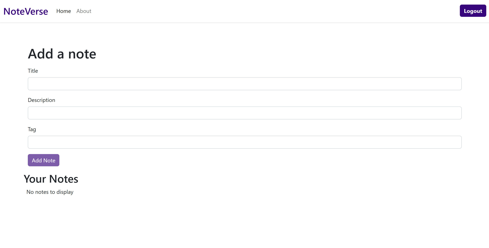
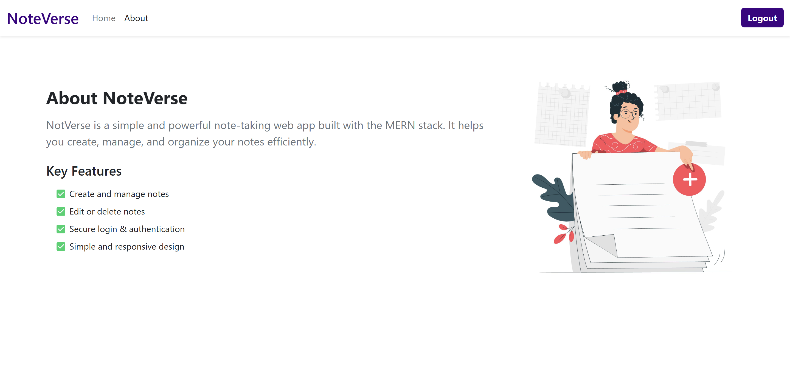

# Notebook App (MERN Stack)

A simple and secure note-taking web application built with the MERN stack.  
Users can create, edit, delete, and view notes after authentication.  

## 📸 Screenshots

### 🏠 Home Page

About

### ✨ Features  
- User Authentication (SignUp, Login, Logout).
- Add, edit, and delete notes.
- Responsive design.
- Protected routes.
- Alert messages for actions.

### 🛠 Tech Stack  
- Frontend: React.js, Bootstrap
- Backend: Node.js, Express.js  
- Database: MongoDB 

## 🚀 Deployment
- **Frontend:** Hosted on [Netlify](https://noteverse-app.netlify.app)
- **Backend:** Hosted on Render.
